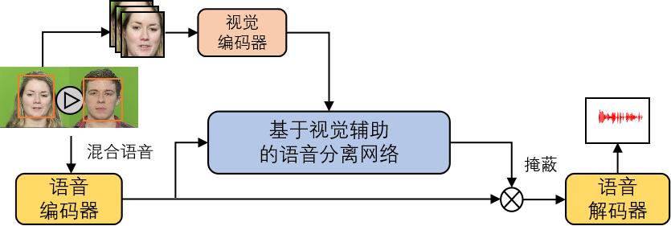

# 样例

## 第一章样例

### 摘要

在这一章中我们提出了基于语音相关视觉特征的视觉辅助语音分离模型，旨在解决鸡尾酒会问题。该模型在四个音视频数据集上 (包括, GRID, TCD-TIMIT, LRS2, AVSpeech) 优于之前所有的视觉辅助语音分离模型，并且在真实复杂听觉场景下取得了令人惊艳的结果。

### 我们提出的模型

整个模型的框架如下图所示，详细设计细节及思路在论文中进行了说明。首先，利用人脸检测和人脸跟踪算法获得场景中/混合语音中说话人的数目并得到每个说话人的人脸缩略图；然后，由视觉编码器提取语音相关的视觉特征，语音编码器提取混合语音声学特征；最后，视觉辅助语音分离网络输入被关注说话人的语音相关视觉特征和混合语音声学特征后，输出被关注说话人的语音。

### 分离样例

#### 样例1

用于测试的模型在AVSpeech数据集 (中文仅占1%左右) 上训练得到，用于测试的视频从中文视频网上获取，在SNR-5到5 dB范围内混合。结果显示，由我们的模型分离得到的语音在听感和语音识别性能上都得到了大幅度的提升。此外，模型表现出不依赖于说话人，并且不依赖于语种的良好性质。

<video id="01" controls="" preload="none">
<source id="wmv" src="./sample/first_chapter/sample1/001.wmv">
</video>

#### 样例2

该小节展示的样例通过手机、笔记本、带摄像头的麦克风等设备在真实复杂声学环境下录制得到，用于测试的模型在AVSpeech数据集 (中文仅占1%左右) 上训练得到，经过我们的模型处理前后的视频展示结果如下所示 (处理前的视频-->处理后的视频)：

<video id="1_noisy" controls="" preload="none">
<source id="mp4" src="./sample/first_chapter/sample2/sample_1_noisy.mp4">
</video>

<video id="1_separated" controls="" preload="none">
<source id="mp4" src="./sample/first_chapter/sample2/sample_1_separated.mp4">
</video>

<video id="2_noisy" controls="" preload="none">
<source id="mp4" src="./sample/first_chapter/sample2/sample_2_noisy.mp4">
</video>

<video id="2_separated" controls="" preload="none">
<source id="mp4" src="./sample/first_chapter/sample2/sample_2_separated.mp4">
</video>

剩余样例以音频形式展示 (处理前的音频-->处理后的音频)：

<audio id="1_noisy" controls="" preload="none">
<source id="wav" src="./sample/first_chapter/sample3/sample_1_noisy.wav">
</audio>

<audio id="1_separated" controls="" preload="none">
<source id="wav" src="./sample/first_chapter/sample3/sample_1_separated.wav">
</audio>

<audio id="2_noisy" controls="" preload="none">
<source id="wav" src="./sample/first_chapter/sample3/sample_2_noisy.wav">
</audio>

<audio id="2_separated" controls="" preload="none">
<source id="wav" src="./sample/first_chapter/sample3/sample_2_separated.wav">
</audio>

<audio id="3_noisy" controls="" preload="none">
<source id="wav" src="./sample/first_chapter/sample3/sample_3_noisy.wav">
</audio>

<audio id="3_separated" controls="" preload="none">
<source id="wav" src="./sample/first_chapter/sample3/sample_3_separated.wav">
</audio>

#### 样例3

该小节展示模型在标准数据集上的语音分离效果，两个说话人混合的情况：

##### 混合语音

<audio id="1_mix" controls="" preload="none">
<source id="wav" src="./sample/first_chapter/sample4/1/mix.wav">
</audio>

##### 分离语音

<audio id="1_pre1" controls="" preload="none">
<source id="wav" src="./sample/first_chapter/sample4/1/pre1.wav">
</audio>

<audio id="1_pre2" controls="" preload="none">
<source id="wav" src="./sample/first_chapter/sample4/1/pre2.wav">
</audio>

