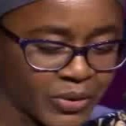
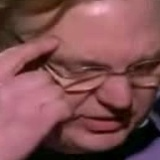
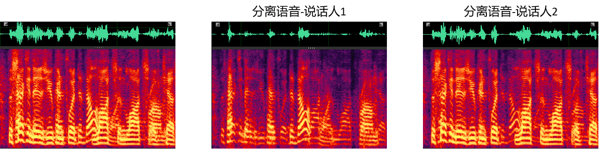
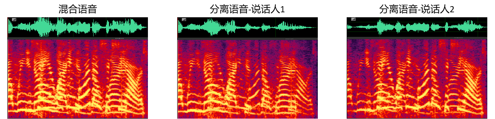

# 样例

## 第二章样例

### 摘要

本文提出了一种基于动态视觉特征的语音分离模型 AVMS (Audio-Visual speech separation Model using Speech-related visual features)。本文首先对现有的动态视觉特征提取方法做了分析，发现对语音分离任务最有效的动态视觉特征应该与语音具有很强的相关性。本文提出采用学习联合视听觉表示和领域对抗训练的方法来提取该视觉特征，并基于时域编码方法和时序卷积神经网络构建模型。本文在 4 个音视频基准数据集上进行了细致的实验，实验结果表明，AVMS 优于目前最先进的基于视觉辅助的语音分离模型，另外，本文还测试了模型在真实复杂声学场景中的语音分离效果，结果表明模型在多种场景中都取得了令人惊艳的性能，使目标语音的纯净度明显上升，这表明模型具有很强的应用价值。为了缓解部分视觉信息 (视频帧) 丢失时语音分离性能急剧下降的问题，本文提出了随机丢失视频帧的训练策略，该训练策略可以显著增强模型的鲁棒性，使模型在视频帧随机丢失和视频帧连续丢失场景下都可以维持很好的性能。

### 我们提出的模型

整个模型的框架如下图所示，详细设计细节及思路在论文中进行了说明。首先，利用人脸检测和人脸跟踪算法获得场景中/混合语音中说话人的数目并得到每个说话人的人脸缩略图；然后，由视觉编码器提取语音相关的视觉特征，语音编码器提取混合语音声学特征；最后，视觉辅助语音分离网络输入被关注说话人的语音相关视觉特征和混合语音声学特征后，输出被关注说话人的语音。

### 分离样例

#### 样例1

用于测试的模型在AVSpeech数据集 (中文仅占1%左右) 上训练得到，用于测试的视频从中文视频网上获取，在SNR-5到5 dB范围内混合。结果显示，由我们的模型分离得到的语音在听感和语音识别性能上都得到了大幅度的提升。此外，模型表现出不依赖于说话人，并且不依赖于语种的良好性质。

<video id="01" controls="" preload="none">
<source id="wmv" src="./sample/first_chapter/sample1/001.wmv">
</video>

#### 样例2

该小节展示的样例通过手机、笔记本、带摄像头的麦克风等设备在真实复杂声学环境下录制得到，用于测试的模型在AVSpeech数据集 (中文仅占1%左右) 上训练得到，经过我们的模型处理前后的视频展示结果如下所示 (处理前的视频-->处理后的视频)：

<video id="1_noisy" controls="" preload="none">
<source id="mp4" src="./sample/first_chapter/sample2/sample_1_noisy.mp4">
</video>
<video id="1_separated" controls="" preload="none">
<source id="mp4" src="./sample/first_chapter/sample2/sample_1_separated.mp4">
</video>

<video id="2_noisy" controls="" preload="none">
<source id="mp4" src="./sample/first_chapter/sample2/sample_2_noisy.mp4">
</video>
<video id="2_separated" controls="" preload="none">
<source id="mp4" src="./sample/first_chapter/sample2/sample_2_separated.mp4">
</video>

剩余样例以音频形式展示 (处理前的音频-->处理后的音频)：

******************************************************************************
<audio id="1_noisy" controls="" preload="none">
<source id="wav" src="./sample/first_chapter/sample3/sample_1_noisy.wav">
</audio>
<audio id="1_separated" controls="" preload="none">
<source id="wav" src="./sample/first_chapter/sample3/sample_1_separated.wav">
</audio>
******************************************************************************

******************************************************************************
<audio id="2_noisy" controls="" preload="none">
<source id="wav" src="./sample/first_chapter/sample3/sample_2_noisy.wav">
</audio>
<audio id="2_separated" controls="" preload="none">
<source id="wav" src="./sample/first_chapter/sample3/sample_2_separated.wav">
</audio>
******************************************************************************

******************************************************************************
<audio id="3_noisy" controls="" preload="none">
<source id="wav" src="./sample/first_chapter/sample3/sample_3_noisy.wav">
</audio>
<audio id="3_separated" controls="" preload="none">
<source id="wav" src="./sample/first_chapter/sample3/sample_3_separated.wav">
</audio>
******************************************************************************

#### 样例3

该小节展示模型在标准数据集 (GRID, TCD-TIMIT and etc.) 上的语音分离效果，两个说话人混合的情况：

******************************************************************************
##### 混合语音-1
<audio id="1_mix" controls="" preload="none">
<source id="wav" src="./sample/first_chapter/sample4/1/mix.wav">
</audio>
##### 分离语音-1
<audio id="1_pre1" controls="" preload="none">
<source id="wav" src="./sample/first_chapter/sample4/1/pre1.wav">
</audio>
<audio id="1_pre2" controls="" preload="none">
<source id="wav" src="./sample/first_chapter/sample4/1/pre2.wav">
</audio>
******************************************************************************

******************************************************************************
##### 混合语音-2
<audio id="3_mix" controls="" preload="none">
<source id="wav" src="./sample/first_chapter/sample4/3/mix.wav">
</audio>
##### 分离语音-2
<audio id="3_pre1" controls="" preload="none">
<source id="wav" src="./sample/first_chapter/sample4/3/pre1.wav">
</audio>
<audio id="3_pre2" controls="" preload="none">
<source id="wav" src="./sample/first_chapter/sample4/3/pre2.wav">
</audio>
******************************************************************************

******************************************************************************
##### 混合语音-3
<audio id="5_mix" controls="" preload="none">
<source id="wav" src="./sample/first_chapter/sample4/5/mix.wav">
</audio>
##### 分离语音-3
<audio id="5_pre1" controls="" preload="none">
<source id="wav" src="./sample/first_chapter/sample4/5/pre1.wav">
</audio>
<audio id="5_pre2" controls="" preload="none">
<source id="wav" src="./sample/first_chapter/sample4/5/pre2.wav">
</audio>
******************************************************************************

******************************************************************************
##### 混合语音-4
<audio id="12_mix" controls="" preload="none">
<source id="wav" src="./sample/first_chapter/sample4/12/mix.wav">
</audio>
##### 分离语音-4
<audio id="12_pre1" controls="" preload="none">
<source id="wav" src="./sample/first_chapter/sample4/12/pre1.wav">
</audio>
<audio id="12_pre2" controls="" preload="none">
<source id="wav" src="./sample/first_chapter/sample4/12/pre2.wav">
</audio>
******************************************************************************

******************************************************************************
##### 混合语音-5
<audio id="10_mix" controls="" preload="none">
<source id="wav" src="./sample/first_chapter/sample4/10/mix.wav">
</audio>
##### 分离语音-5
<audio id="10_pre1" controls="" preload="none">
<source id="wav" src="./sample/first_chapter/sample4/10/pre1.wav">
</audio>
<audio id="10_pre2" controls="" preload="none">
<source id="wav" src="./sample/first_chapter/sample4/10/pre2.wav">
</audio>
******************************************************************************

******************************************************************************
##### 混合语音-6
<audio id="8_mix" controls="" preload="none">
<source id="wav" src="./sample/first_chapter/sample4/8/mix.wav">
</audio>
##### 分离语音-6
<audio id="8_pre1" controls="" preload="none">
<source id="wav" src="./sample/first_chapter/sample4/8/pre1.wav">
</audio>
<audio id="8_pre2" controls="" preload="none">
<source id="wav" src="./sample/first_chapter/sample4/8/pre2.wav">
</audio>
******************************************************************************

## 第三章样例

### 摘要

本文将时域编码、门控机制、对抗训练方法应用到基于静态视觉特征的语音分离模型中来提升性能。本文分析了现有的基于静态视觉特征的语音分离模型性能差的原因，并提出了相应的优化策略。具体地，造成模型性能差的原因有两个：(1) 现有模型均采用时频域编码方法，它存在语音相位难以估计的问题；(2) 人脸图像受多种因素 (例如，光照和位姿等) 的影响产生多样性，并且用来训练模型的数据量有限，不能消除多样性带来的干扰，所以导致模型的泛化能力变差。针对第一个原因，本文采用时域编码方法，并使用门控双通道循环神经网络来构建模型，这不仅可以有效避免相位估计问题，并且增强了模型处理时序数据的能力，从而提升模型性能。针对第二个原因，本文提出利用对抗训练在视觉特征层面来隐式建模人脸图像的多样性，从而提升模型的泛化能力。实验结果表明，上述策略可以显著提升模型的性能，与基线模型相比，本文提出的模型信号失真比 (signal-to-distortion ratio, SDR) 的提升为 106\%。

### 分离样例

我们提出的基于生成对抗训练的在线视觉辅助语音分离模型在标准数据集 (LRS3) 上的分离样例如下所示：

******************************************************************************
##### 混合语音-1
<audio id="1_mix" controls="" preload="none">
<source id="wav" src="./sample/third_chapter/2_mix1.wav">
</audio>
##### speaker1-1 (参考人脸-->纯净语音-->分离语音)

<audio id="1_true1" controls="" preload="none">
<source id="wav" src="./sample/third_chapter/2_true1.wav">
</audio>
<audio id="1_pre1" controls="" preload="none">
<source id="wav" src="./sample/third_chapter/2_pre1.wav">
</audio>
##### speaker2-1 (参考人脸-->纯净语音-->分离语音)

<audio id="1_true2" controls="" preload="none">
<source id="wav" src="./sample/third_chapter/2_true2.wav">
</audio>
<audio id="1_pre2" controls="" preload="none">
<source id="wav" src="./sample/third_chapter/2_pre2.wav">
</audio>
******************************************************************************

******************************************************************************
##### 混合语音-2
<audio id="3_mix" controls="" preload="none">
<source id="wav" src="./sample/third_chapter/3_mix1.wav">
</audio>
##### speaker1-2 (参考人脸-->纯净语音-->分离语音)

<audio id="3_true1" controls="" preload="none">
<source id="wav" src="./sample/third_chapter/3_true1.wav">
</audio>
<audio id="3_pre1" controls="" preload="none">
<source id="wav" src="./sample/third_chapter/3_pre1.wav">
</audio>
##### speaker2-2 (参考人脸-->纯净语音-->分离语音)

<audio id="3_true2" controls="" preload="none">
<source id="wav" src="./sample/third_chapter/3_true2.wav">
</audio>
<audio id="3_pre2" controls="" preload="none">
<source id="wav" src="./sample/third_chapter/3_pre2.wav">
</audio>
******************************************************************************

******************************************************************************
##### 混合语音-3
<audio id="4_mix" controls="" preload="none">
<source id="wav" src="./sample/third_chapter/4_mix1.wav">
</audio>
##### speaker1-3 (参考人脸-->纯净语音-->分离语音)

<audio id="4_true1" controls="" preload="none">
<source id="wav" src="./sample/third_chapter/4_true1.wav">
</audio>
<audio id="4_pre1" controls="" preload="none">
<source id="wav" src="./sample/third_chapter/4_pre1.wav">
</audio>
##### speaker2-3 (参考人脸-->纯净语音-->分离语音)

<audio id="4_true2" controls="" preload="none">
<source id="wav" src="./sample/third_chapter/4_true2.wav">
</audio>
<audio id="4_pre2" controls="" preload="none">
<source id="wav" src="./sample/third_chapter/4_pre2.wav">
</audio>
******************************************************************************

******************************************************************************
##### 混合语音-4
<audio id="7_mix" controls="" preload="none">
<source id="wav" src="./sample/third_chapter/7_mix1.wav">
</audio>
##### speaker1-4 (参考人脸-->纯净语音-->分离语音)

<audio id="7_true1" controls="" preload="none">
<source id="wav" src="./sample/third_chapter/7_true1.wav">
</audio>
<audio id="7_pre1" controls="" preload="none">
<source id="wav" src="./sample/third_chapter/7_pre1.wav">
</audio>
##### speaker2-4 (参考人脸-->纯净语音-->分离语音)

<audio id="7_true2" controls="" preload="none">
<source id="wav" src="./sample/third_chapter/7_true2.wav">
</audio>
<audio id="7_pre2" controls="" preload="none">
<source id="wav" src="./sample/third_chapter/7_pre2.wav">
</audio>
##### 时域和频域的可视化图：

******************************************************************************

******************************************************************************
##### 混合语音-5
<audio id="9_mix" controls="" preload="none">
<source id="wav" src="./sample/third_chapter/9_mix1.wav">
</audio>
##### speaker1-5 (参考人脸-->纯净语音-->分离语音)

<audio id="9_true1" controls="" preload="none">
<source id="wav" src="./sample/third_chapter/9_true1.wav">
</audio>
<audio id="9_pre1" controls="" preload="none">
<source id="wav" src="./sample/third_chapter/9_pre1.wav">
</audio>
##### speaker2-5 (参考人脸-->纯净语音-->分离语音)

<audio id="9_true2" controls="" preload="none">
<source id="wav" src="./sample/third_chapter/9_true2.wav">
</audio>
<audio id="9_pre2" controls="" preload="none">
<source id="wav" src="./sample/third_chapter/9_pre2.wav">
</audio>
##### 时域和频域的可视化图：

******************************************************************************

从上述结果可以看出，模型在分离两个异性说话人时效果优异；但是在分离同性说话人时 (男-男, 女-女), 性能较差，具体地，可以有效抑制干扰说话人的声音，但是不能完全消除，另外，从时域和频域的可视化图中可以看出分离效果还是存在的。该问题是基于说话人身份信息指导语音分离技术的痛点，比如以voicefilter为代表的工作。但该问题可以使用第2章的模型有效解决!

## 第四章样例

### 摘要

本文提出了一种基于生成对抗训练的在线视觉辅助语音分离模型，目的是拓展模型在视频通话和人机交互等在线场景中的应用。具体地，本文采用因果时序卷积神经网络构建模型，使其在理论上满足实时处理的要求；另外，本文提出了在线流式推理策略，该策略可以使模型在 GPU、CPU 和手机移动芯片上部署并满足在线语音分离的要求，并且不会造成任何性能损失。为了缓解尺度不变信噪比 (scale-invariant signal-to-noise ratio, SI-SNR) 损失函数造成的负面影响：分离语音缺乏真实语音的精细结构。本文采用生成对抗训练方法来优化整个模型，通过生成器 (在线视觉辅助语音分离模型) 和鉴别器之间的对抗博弈来使分离语音在高维空间中趋近于真实语音。实验结果表明，该方法在不增加任何模型参数的情况下，可以同时提升分离语音的听感和语音识别性能。本文第一次探索了面向端侧部署的在线视觉辅助语音分离模型的设计方法，为该模型在在线场景中的应用迈出了重要一步。

### 分离样例

我们提出的基于生成对抗训练的在线视觉辅助语音分离模型在标准数据集 (LRS2) 上的分离样例如下所示：

******************************************************************************
##### 混合语音-1
<audio id="1_mix" controls="" preload="none">
<source id="wav" src="./sample/second_chapter/1_mix.wav">
</audio>
##### speaker1-1 (纯净语音-->分离语音)
<audio id="1_true1" controls="" preload="none">
<source id="wav" src="./sample/second_chapter/1_true1.wav">
</audio>
<audio id="1_pre1" controls="" preload="none">
<source id="wav" src="./sample/second_chapter/1_pre1.wav">
</audio>
##### speaker2-1 (纯净语音-->分离语音)
<audio id="1_true2" controls="" preload="none">
<source id="wav" src="./sample/second_chapter/1_true2.wav">
</audio>
<audio id="1_pre2" controls="" preload="none">
<source id="wav" src="./sample/second_chapter/1_pre2.wav">
</audio>
******************************************************************************

******************************************************************************
##### 混合语音-2
<audio id="2_mix" controls="" preload="none">
<source id="wav" src="./sample/second_chapter/2_mix.wav">
</audio>
##### speaker1-2 (纯净语音-->分离语音)
<audio id="2_true1" controls="" preload="none">
<source id="wav" src="./sample/second_chapter/2_true1.wav">
</audio>
<audio id="2_pre1" controls="" preload="none">
<source id="wav" src="./sample/second_chapter/2_pre1.wav">
</audio>
##### speaker2-2 (纯净语音-->分离语音)
<audio id="2_true2" controls="" preload="none">
<source id="wav" src="./sample/second_chapter/2_true2.wav">
</audio>
<audio id="2_pre2" controls="" preload="none">
<source id="wav" src="./sample/second_chapter/2_pre2.wav">
</audio>
******************************************************************************

******************************************************************************
##### 混合语音-3
<audio id="10_mix" controls="" preload="none">
<source id="wav" src="./sample/second_chapter/10_mix.wav">
</audio>
##### speaker1-3 (纯净语音-->分离语音)
<audio id="10_true1" controls="" preload="none">
<source id="wav" src="./sample/second_chapter/10_true1.wav">
</audio>
<audio id="10_pre1" controls="" preload="none">
<source id="wav" src="./sample/second_chapter/10_pre1.wav">
</audio>
##### speaker2-3 (纯净语音-->分离语音)
<audio id="10_true2" controls="" preload="none">
<source id="wav" src="./sample/second_chapter/10_true2.wav">
</audio>
<audio id="10_pre2" controls="" preload="none">
<source id="wav" src="./sample/second_chapter/10_pre2.wav">
</audio>
******************************************************************************

******************************************************************************
##### 混合语音-4
<audio id="4_mix" controls="" preload="none">
<source id="wav" src="./sample/second_chapter/4_mix.wav">
</audio>
##### speaker1-4 (纯净语音-->分离语音)
<audio id="4_true1" controls="" preload="none">
<source id="wav" src="./sample/second_chapter/4_true1.wav">
</audio>
<audio id="4_pre1" controls="" preload="none">
<source id="wav" src="./sample/second_chapter/4_pre1.wav">
</audio>
##### speaker2-4 (纯净语音-->分离语音)
<audio id="4_true2" controls="" preload="none">
<source id="wav" src="./sample/second_chapter/4_true2.wav">
</audio>
<audio id="4_pre2" controls="" preload="none">
<source id="wav" src="./sample/second_chapter/4_pre2.wav">
</audio>
******************************************************************************

******************************************************************************
##### 混合语音-5
<audio id="5_mix" controls="" preload="none">
<source id="wav" src="./sample/second_chapter/5_mix.wav">
</audio>
##### speaker1-5 (纯净语音-->分离语音)
<audio id="5_true1" controls="" preload="none">
<source id="wav" src="./sample/second_chapter/5_true1.wav">
</audio>
<audio id="5_pre1" controls="" preload="none">
<source id="wav" src="./sample/second_chapter/5_pre1.wav">
</audio>
##### speaker2-5 (纯净语音-->分离语音)
<audio id="5_true2" controls="" preload="none">
<source id="wav" src="./sample/second_chapter/5_true2.wav">
</audio>
<audio id="5_pre2" controls="" preload="none">
<source id="wav" src="./sample/second_chapter/5_pre2.wav">
</audio>
******************************************************************************

******************************************************************************
##### 混合语音-6
<audio id="6_mix" controls="" preload="none">
<source id="wav" src="./sample/second_chapter/6_mix.wav">
</audio>
##### speaker1-6 (纯净语音-->分离语音)
<audio id="6_true1" controls="" preload="none">
<source id="wav" src="./sample/second_chapter/6_true1.wav">
</audio>
<audio id="6_pre1" controls="" preload="none">
<source id="wav" src="./sample/second_chapter/6_pre1.wav">
</audio>
##### speaker2-6 (纯净语音-->分离语音)
<audio id="6_true2" controls="" preload="none">
<source id="wav" src="./sample/second_chapter/6_true2.wav">
</audio>
<audio id="6_pre2" controls="" preload="none">
<source id="wav" src="./sample/second_chapter/6_pre2.wav">
</audio>
******************************************************************************

******************************************************************************
##### 混合语音-7
<audio id="8_mix" controls="" preload="none">
<source id="wav" src="./sample/second_chapter/8_mix.wav">
</audio>
##### speaker1-7 (纯净语音-->分离语音)
<audio id="8_true1" controls="" preload="none">
<source id="wav" src="./sample/second_chapter/8_true1.wav">
</audio>
<audio id="8_pre1" controls="" preload="none">
<source id="wav" src="./sample/second_chapter/8_pre1.wav">
</audio>
##### speaker2-7 (纯净语音-->分离语音)
<audio id="8_true2" controls="" preload="none">
<source id="wav" src="./sample/second_chapter/8_true2.wav">
</audio>
<audio id="8_pre2" controls="" preload="none">
<source id="wav" src="./sample/second_chapter/8_pre2.wav">
</audio>
******************************************************************************

******************************************************************************
##### 混合语音-8
<audio id="9_mix" controls="" preload="none">
<source id="wav" src="./sample/second_chapter/9_mix.wav">
</audio>
##### speaker1-8 (纯净语音-->分离语音)
<audio id="9_true1" controls="" preload="none">
<source id="wav" src="./sample/second_chapter/9_true1.wav">
</audio>
<audio id="9_pre1" controls="" preload="none">
<source id="wav" src="./sample/second_chapter/9_pre1.wav">
</audio>
##### speaker2-8 (纯净语音-->分离语音)
<audio id="9_true2" controls="" preload="none">
<source id="wav" src="./sample/second_chapter/9_true2.wav">
</audio>
<audio id="9_pre2" controls="" preload="none">
<source id="wav" src="./sample/second_chapter/9_pre2.wav">
</audio>
******************************************************************************

******************************************************************************
##### 混合语音-9
<audio id="3_mix" controls="" preload="none">
<source id="wav" src="./sample/second_chapter/3_mix.wav">
</audio>
##### speaker1-9 (纯净语音-->分离语音)
<audio id="3_true1" controls="" preload="none">
<source id="wav" src="./sample/second_chapter/3_true1.wav">
</audio>
<audio id="3_pre1" controls="" preload="none">
<source id="wav" src="./sample/second_chapter/3_pre1.wav">
</audio>
##### speaker2-9 (纯净语音-->分离语音)
<audio id="3_true2" controls="" preload="none">
<source id="wav" src="./sample/second_chapter/3_true2.wav">
</audio>
<audio id="3_pre2" controls="" preload="none">
<source id="wav" src="./sample/second_chapter/3_pre2.wav">
</audio>
******************************************************************************
